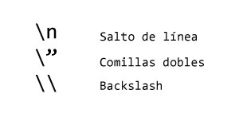
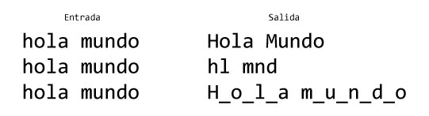
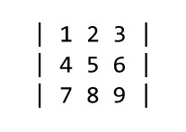

# Arreglos, matrices y cadenas

### ¿Qué es un arreglo?

Es una estructura que permite agrupar un conjunto de valores en una variable, por medio de una relación clave valor, donde la clave sirve como indice que indica donde esta almacenado el valor. Es una estructura dinámica, es decir puede aumentar o disminuir su longitud en tiempo de ejecución y cuenta con varias propiedades que nos permiten interactuar con los datos, la longitud, los indices entre otros.


Para crear un arreglo se puede hacer de múltiples maneras, a continuación se muestra una inicialización clásica, donde primero se declara el arreglo y luego se asignan los datos en orden.

```javascript
let tren = [];
tren[0] = 35;
tren[1] = 1002;
tren[2] = 82;
tren[3] = -15;
```

Los valores del arreglo, gracias a la versátilidad de javascript para representar las variables, pueden ser de cualquier tipo, incluso los indices pueden ser valores diferentes a números, como lo muestra el siguiente ejemplo.

```javascript
let circo = Array();
circo[1] = 5;
circo["jaula"] = 79;
circo[2.5] = "Leon";
circo[-2] = true;
circo[false] = 2.5;
console.dir(circo);
```


Se puede usar cualquier tipo de dato visto hasta el momento como clave y como valor, la clave sirve para consultar el dato, para asignarlo y para reasignarlo.


```javascript
let circo = new Array();
circo[3456] = "Elefante"; //Asignación
circo[3456] = "Jirafa";//Reasignación
console.log("El animal número ",3456,"es",circo[3456]); //Consulta
```

#### ¿Cómo se recorre un arreglo cuyos indices no son unicamente números?

En este caso recorremos al ciclo for, usando el operador in o of, veamos el ejemplo

```javascript
let circo = Array();
circo[1] = 5;
circo["hola"]=79;
circo[2.5] = "texto";
circo[-2] = true;
circo[false]=2.5;

for(let i in circo)
{
	console.log(i,circo[i]);  
}
```


¿Qué pasa si cambiamos in por of en el código anterior?


Si los indices del arreglo todos son números, es posible recorrer la estructura con un for clásico.

```javascript
let zoologico = ["Leon","Mico","Loro","Elefante","Jirafa"];
for(let i=0; i<zoologico.length;i++)
{
    console.log("El animal",i,"es",zoologico[i]);
}
```


La propiedad length permite conocer la longitud del arreglo, se puede usar cuando los datos son asignados por medio de un indice de tipo entero


###  ¿Qué es una mátriz?

En javascript es un arreglo de arreglos, es poner un arreglo en cada posición de un arreglo principal, esta estructura puede ser cuadrada, rectangular o incluso no tener una simetría o configuración rígida como sucede con las matrices en otros lenguajes.


```javascript
let matriz = [[1, 2, 3],[4, 5, 6],[7,8, 9]];
var fila;
for(var i = 0; i<matriz.length;i++)
{
    fila = matriz[i];
    
    for(var j = 0; j<fila.length;j++)
    {
        columna = fila[j];
        
        console.log("celda (",i,",",j,")",columna);
    }
}
```


En el ejemplo anterior se imprime cada celda de la matriz, accediendo por medio de un indice númerico que representa ubicación teniendo en cuenta la fila y la columna


### ¿Qué es una cadena?

Es un conjunto de carácteres o datos alfanúmericos, es la representa de un texto en un variable. Se representan en memoria similar a un arreglo, donde cada carácter tiene asociado un indice númerico entero positivo mayor o igual a cero.

```javascript
let texto = "Hoy será un gran día";
```

Es posible usar la notación de arreglo para acceder o recorrer la cadena, pero solo funciona como medio de lectura no permite asignación.

```javascript
let texto = "Hoy será un gran día";
console.log("Primer carácter",texto[0]);
texto[0] = 3; // No tiene ningun efecto, pero no es un error
console.log(texto);
```


También es posible usar la propiedad length como en los arreglos, pero para este caso se debe usar `length()` para conocer la longitud de la cadena ``


Se puede representar el contenido usando comillas simples o comillas dobles, incluso se pueden mezclar en la misma sentencia.


Si se usa comillas doble por fuera, se pueden usar comillas simples por dentro y viceversa


```javascript
let frase = '"Talk is cheap, show me the code" - Linus Torvalds';
console.log(frase);
```


¿Qué pasa si se requiere representar una combinación de comillas simples y dobles en un texto?


### Secuencias de escape

Permite representar en una cadena caracteres que no se pueden asignar por restricciones en su creación.



```javascript
let texto_escapado = "\"Talk is cheap, show me the code\" - Linus Torvalds";
```


Es posible escapar cualquier caracter, por ejemplo cuando se requieren mostrar caracteres especiales del español en un mensaje de alerta, revisar los referentes de esta sección para ver como se hace.


### Ejercicios

Realice un programa que...

1.  Cuente las palabras de una frase
2.  Invierta una cadena
3. Invierta un arreglo
4. Calcule el promedio de un arreglos de números
5. Imprima en un mensaje de alerta la cadena: El veloz murciélago hindú comía feliz cardillo y kiwi. La cigüeña toca el saxofón detrás del palenque de paja. 
6. Sume dos matrices
7. Múltiplique dos matrices

* Convierta una cadena así:



* Imprima una mátriz con el siguiente formato:



### Referentes

* [Cadenas de escape](http://www.etnassoft.com/2010/12/28/cadenas-de-escape-como-poner-tildes-en-javascript/)
* [Operación de matrices 1/2](http://es.onlinemschool.com/math/assistance/matrix/multiply/)
* [Operación de matrices 2/2](https://matrixcalc.org/es/)

