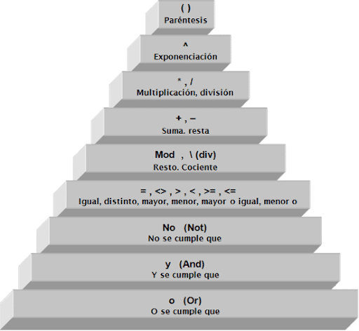

# Operadores y condiciones

## Operadores

Los operadores nos permiten realizar operaciones entre uno o más valores, los lenguajes de programación soportan las operaciones básicas usadas en matemáticas, pero además incluyen otros operadores propios de la programación, los cuales estudiaremos en esta sección.

### Operadores aritméticos

Operaciones básicas matemáticas, permiten realizar cálculos tales como: suma, resta, múltiplicación, división y residuo o módulo.

#### Suma

```text
var suma = 5 + 3;
```

#### Resta

```text
var resta = 8 - 2;
```

#### Multiplicación

```text
var multiplicacion = 8 * 3;
```

#### División

```text
var division = 8 / 2;
```

#### Módulo

```text
var modulo = 5 % 3;
```

### Operadores de relación

Permite realizar comparaciones entre valores, para determinar relaciones en los datos tale como: igualdad, dierencia y desigualdad.

#### Mayor que, mayor o igual

```text
var mayor = 5 > 3;
var mayor_igual = 7 >= -2; 
```

#### Menor que, menor o igual

```text
var menor = 12 < 3;
var menor_igual = 1 <= 8; 
```

#### Igual

```text
var igual = 5 == 5;
```


Tenga en cuenta que `=` se debe interpretar en programación, como el operador de asignación, es decir, sirve para asignar un valor a una variable. Y `==` es el operador comparación, que permite comparar, NO asignar.


#### Diferente

```text
var diferente = 8 != 2;
```

### Operadores lógicos

Son operadores bastante usados en programación, permiten realizar operaciones sobre valores de verdad, es decir sobre verdadero \(true\) o falso \(false\)

#### And - y lógica - Conjunción

```text
var operacion_y = true && false;
```

#### Or - o lógica - Disyunción

```text
var operacion_o = false || true;
```

#### Not - negación

```text
var negacion = !true;
```

Como complemento para entender como funcionan estos operadores, recomiendo guardar, transcribir, incluir en sus apuntes la siguiente tabla.


### Condición 👀

A continuación vamos a definir que va a ser para nosotros una condición en programación:

> Es una pregunta, cuyas únicas posibles respuestas son verdadero o falso

Para crear una condición, además de la definición, debemos tener presente realizar una pregunta, teniendo como herramienta, los diferentes tipos de operadores vistos previamente. Hay total libertad en la creación de una condición, siempre y cuando se cumpla con la definición.

Ejemplo condición

```text
var condicion = 4 > 5 && 5+3 == 2;
```


Para facilitar la escritura de expresiones con varios operadores y operandos, se recomienda usar los paréntesis y tener presente además la precedencia de operadores. 


### Precendencia de operadores

Indica como se evaluan los operadores y operandos en una expresión, basicamente el interprete del lenguaje de programación lo que hace es primero recorrer la expresión y realiza una clasificación denominada precedencia de operadores, dada por la operación que se va a realizar, cada operador tiene una prioridad frente a otros operadores.

Para conocer en detalle la precedencia de operadores, existe la siguiente gráfica, que aplica para la mayoría de lenguajes de programación.




Hay algunos operadores que cambian, en javascript, sin embargo el orden de prioridad para los operadores que aplican para javascript es el mismo que indica la gráfica.


Los paréntesis son `gratis` en programación, no nos cuestan nada, por tanto no dude en usarlos para darle mayor prioridad a una operación sobre las demás. Ayuda a darle un orden a una expresión, tanto de manera gráfica como a la hora de ser evaluada la expresión.

### Ejercicios

1. Ejecute cada uno de los ejemplos de código  de cada operación, valide su resultado imprimiendo usando console o alert.
2. Realice 20 expresiones que combinen diferentes operadores, imprima el resultado de cada expresión y usando typeof, determine de que tipo es la respuesta. ¿Siempre es un número?
3. Cree 20 condiciones, combinando los operadores vistos. Recuerde que una condición siempre retorna verdadero o falso.
4. ¿Para que se puede usar el operador módulo en programación?
5. ¿Qué es corto circuito en una condición?
6. ¿Qué es algebra booleana?,¿Quién fue George Boole?
7. ¿Qué otros valores son considerados verdaderos o falsos en javascript?
8. ¿Qué otros operadores existen en javascript?
9. Identifique los operadores de la piramide de precedencia que no son compatibles con javascript
10. Reescriba la siguiente expresión y evaluela en javascript.


