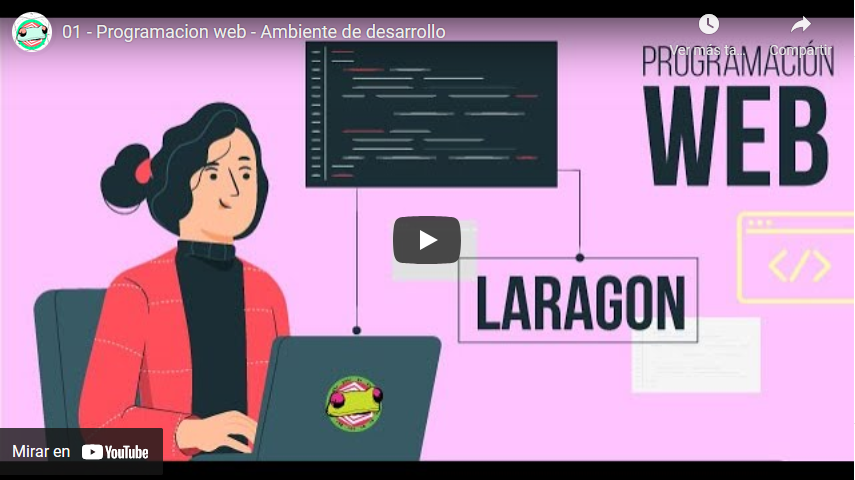

# Ambiente de desarrollo

## Lista de herramientas

* Editor de texto plano
* Terminal de comandos que soporte unix
* Servidor local \(localhost\)
* Navegador web
* Herramientas de desarrollador
* Administrador de paquetes
* Node JS
* GIT

### Actividad

#### Instalar y configurar un ambiente de desarrollo como explica el siguiente [video](https://youtu.be/j9WUtAh-jwE)

#### Realizar un demo, para probar el funcionamiento de un servidor local usando Laragon, como muestra el siguiente [video](https://youtu.be/xJYnmQaDvyE)

#### Responde las siguientes preguntas

1. ¿Para que se usa el localhost?
2. ¿Qué pasa en la barra de navegación cuando se produce una petición GET?
3. ¿Las transacciónes que se realizan con las peticiones vistas son seguras?
4. ¿Qué tipo de transacción realiza un motor de búsqueda?
5. Consulte que es protocolo HTTPS, ¿qué relación tiene con las peticiones GET y POST?

#### Enlaces de interes

* [Laragon](https://laragon.org/) 👀 Incluye terminal, git, base de datos y otras herramientas, todo en uno
* [Cmder ](https://cmder.net/)y [GitBash](https://git-scm.com/downloads) Terminales tipo unix, puede instalar alguna de las dos 💻
* [Firefox](https://www.mozilla.org/es-ES/firefox/new/) Navegador web recomendado para el curso 🔥
* [Sublime Text](https://www.sublimetext.com/) y [Visual Studio Code](https://code.visualstudio.com/) editores de texto plano, sublime es más rápido ⚡ 

