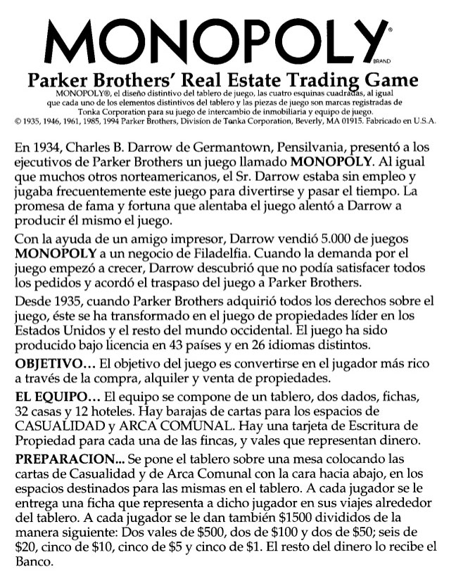

# Pseudocódigo

## ¿Qué es el pseudocódigo?

Es el conjunto de pasos que permiten la solución a un problema. 

### Ejemplos

* Una receta de cocina es el pseudocódigo para preparar un alimento

* Las indicaciones de una ruta, es el pseudocódigo para llegar a un destino

* Las instrucciones de un juego de mesa, es el pseudocódigo de como jugar

## ¿Para que se utiliza?

Se usan para planear y crear la solución a un problema, es el conjunto de pasos que se convertiran en el algoritmo que permite escribir un programa. 

## Pasos para crear un pseudocódigo

* Enumerar cada paso
* El primer paso siempre es el inicio y el último es el fin
* Se debe garantizar que siempre se vaya desde el inicio al fin, puede ser por múltiples rutas
* Los pasos deben crearse según prioridad
* Se pueden crear saltos entre pasos, se recomienda usar la frase "ir a \_\_ " seguido del número de paso
* Se recomienda para mayor claridad , crear el mayor número de pasos posible

## Ejemplo

Pseudocódigo suma de dos números

1. Inicio
2. Ingrese el primer número y guardelo en a
3. Ingrese el segundo número y guardelo en b
4. Sume a y b y almacene el valor en c
5. Imprima el valor de c
6. Fin
