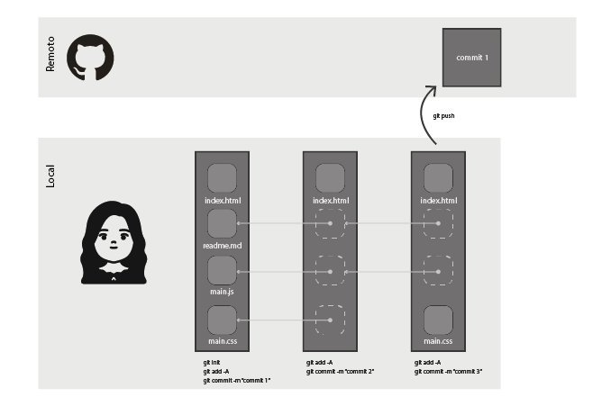
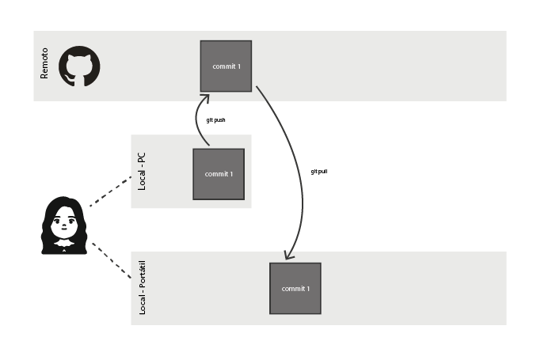
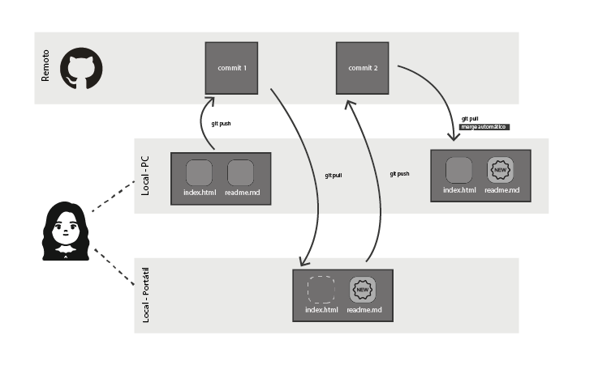
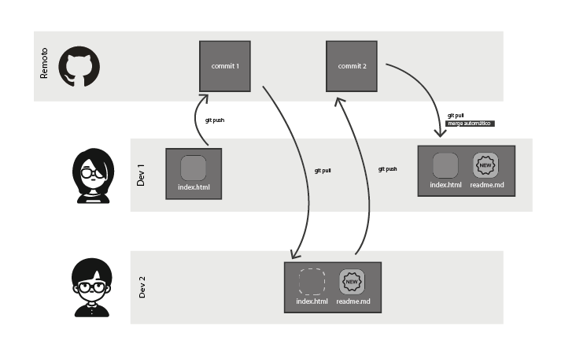
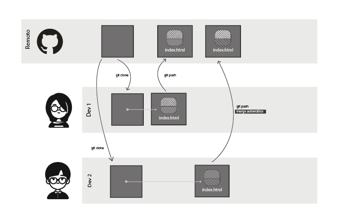

# Merge automático

### Uso del repositorio

Este es el flujo corriente que sigue un usuario, que trabaja de manera local, realizando cambios y registrandolos con commits, luego cuando decide guardar o genera una versión estable sube los cambios al servidor remoto del servicio de git, en este caso github.

### La misma persona desde ubicaciones diferentes

Es posible trabajar en el repositorio usando por ejemplo un computador de escritorio en la oficina y un computador portátil en la casa, en este caso, se usa el siguiente esquema.

### La misma persona, merge automático

Si en cada ubicación, se editan archivos diferentes, al subir y bajar archivos en el proceso de sincronización, se realiza un merge automático

### Dos o más integrantes del equipo, diferentes archivos, merge automático

Si dos o más desarrolladores trabajan sobre la misma versión del proyecto pero sobre archivos diferentes, al realizar git pull y git push, como no hay trabajo en común sobre el mismo archivo, el merge se hace automático, esta es una buena práctica que se recomienda seguir en los equipos de desarrollo, lo cuál requiere de una buena comunicación por parte de los programadores.

### Dos o más integrantes sobre el mismo archivo del mismo repositorio, merge automático, con restricciones

Es posible que varias personas trabajen en simultaneo en el mismo archivo y que se realice un merge automático, para que esto suceda, se tiene que dividir el archivo en líneas por cada desarrollador, por ejemplo: El dev1 puede modificar de la línea 1 hasta la línea 30, el dev2 de la línea 31 hasta la 60, el dev3 de la línea 61 hasta la 100... y así sucesivamente se va repartiendo el espacio del archivo.

Esta estrategía puede ser útil en ciertos casos, pero no es un silver bullet, porque puede ser un mal enfoque en el largo plazo y dependiendo además del tipo de archivo que se este modificando.

### Explicación y ejemplos técnicos

En el siguiente video se explican los casos anteriores, simulando las diferentes ubicaciones y las diferentes cuentas en un mismo equipo, este tema se puede escalar para trabajarlo entre varias personas con acceso al mismo repositorio.



### Ejercicio

1. Crear un repositorio de ejemplo, vincular a varios compañeros de equipo
2. Realizar cada uno de los casos explicados en el video y que se muestran en la imágenes, donde se evidencien los diferentes tipos de merge automático

